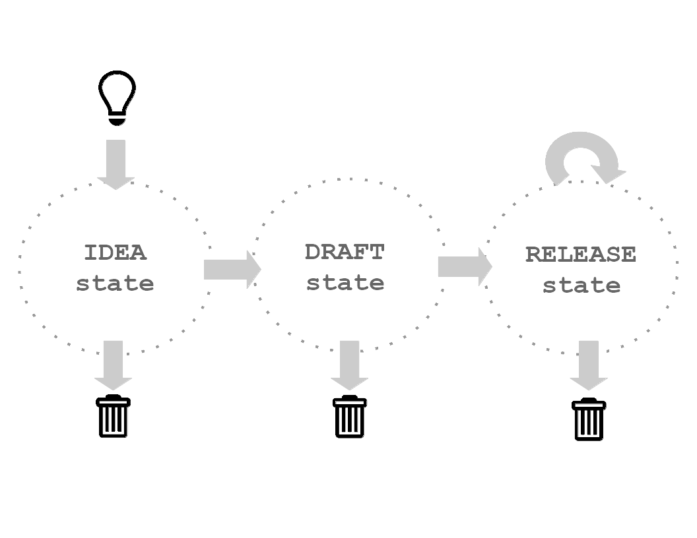
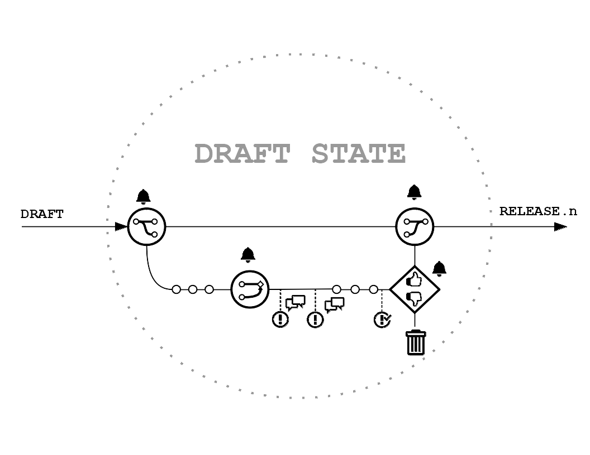

```
AP:      8
Title:   AP Guideline
Repo:    agathis-project
State:   Draft
Type:    Process
License: CC-BY-SA
Author:  md-agathisproject
```

# AP Guideline

## 1. Abstract

The work on Agathis Project github organization is organized using Agathis 
Proposals. An Agathis Proposal describes a development feature, a process or a 
formalized information. This document specifies the general framework of 
Agathis Proposals and specifically how to drive the Process and Information APs 
from idea to release.

## 2. Rationale
AP Guideline helps to:
  1. improve communication through documentation consistency. 
  2. improve productivity through repeatable workflows.

## 3. Content

### 3.1. AP Types
A number of four types of Agathis Proposals are identified:

- **HW (Hardware Development) AP** documents a hardware feature.

- **SW (Software Development) AP** documents a software feature.

- **Process AP** documents how to do things around here with increased efficiency.
 
- **Informational AP** documents useful information.

### 3.2. AP and Repository

- **Informational and Process APs** are always located in agathis-project repo, 
  under their respective AP folder; *AP-?.md* is the main text file, 
  markdown formated.
  
- **Development APs**  are born as ideas in agathis-project repo then moved and 
  grown under their own repo: 
  - while hosted in agathis-project repo, they are located in their respective 
  AP folder, where *AP-?.md* is the main text file, markdown formated.
  - after they pass the idea review, development APs are moved in their own 
  repo with *AP-?.md* file becoming *readme.md* in the repo's root.
  
- the **master** (default) branch can be modified only through merging pull 
  requests; actual work shall be done on a non-master branch.
  
- all merges in agathis-project repo are done by admins only. 

- the merges in development repos are done by their respective authors with 
  admin rights.

### 3.3. Informational and Process AP Workflow
Note: the workflows for HW and SW APs are described in their respective docs.

***
  
### Workflow Overview:



Process and Informational APs have three main states: **Idea, Draft and Release**.

#### 3.3.1. Idea State


**Someone (called author herein) got an idea:** to engage the 
Agathis Project, the author should get a number:

  1. go to agathis-project repo and **open an new issue** labelled **New idea**.

  2. **title** it with intended AP title.

  3. fill in the comments area with the **abstract of the idea**.

  4. append **@admin** tag at the end of the abstract.

  5. **submit** the issue.
	
**This issue will trigger the admin response:**

  1. check AP title and summary for sanity; if the idea is insane skip to 
     step 5.
	 
  2. create a new AP folder with an AP document template; fill in preamble 
     and abstract; the AP number should be taken as the next available in the 
	 AP Index.
	 
  3. list the new AP at *idea* state in the AP Index.
  
  4. create a branch named *AP-?-Title-Idea*.
  
  5. comment the issue and close it.
  
**The author prepares the idea for review:**
  - work on branch *AP-? Title*
	- not too much, not too little: just enough for the team to get the idea
	  and comment - before too much work may get to waste or block team 
	  contributions.
    - commit as needed.
	
**Idea Pull Request**
  - the author open a pull request when ready.
  - discuss and fix issues, comments. 
  - commit as needed.
  
**Idea Review**
- follow process described in AP-9 Review.

#### 3.3.2. Draft State


**Entering the Draft State:**
- if review vote is passed: 
  1. the admin merge the AP as voted with the preamble state updated to Draft.
  2. the admin updates the state to "Draft" in AP-0 AP Index.

**Work on the draft:**
- the author creates a branch named *AP-?-Title-Draft* and edit the AP on this branch.
- commit as needed.

**Draft Pull Request**
- the author open a pull request when ready.
- discuss and fix issues, comments; commit as needed.

**Draft Review**
- when ready, enter draft review: follow AP-9 Review.

#### 3.3.3. Released State


**Entering the Released State:**
- if the review vote is passed:
  1. the admin merge the AP branch with the preamble state updated to Released.
  2. the admin updates the AP state to "Release" in AP Index.

**Work on the release:**
1. issues accumulating.
2. the author creates a branch *AP-?-Title-Release*. 
3. every commit in the release state should refer to an issue; in other words,
   no commits without issues.

**Release Pull Request**
1. the author open a pull request when ready.
2. discuss comments and fix issues.
3. commit as needed.

**Release Review**
- when ready, enter draft review: follow AP-9 Review.

Note1: for Informational and Process AP, at any time, there is only one valid 
release: the master (default branch) - is the latest and the greatest.

Note2: *AP-0 AP Index* is always edited on the master branch.

Note3: Workflows already in progress should adapt on-the-fly to latest relevant 
APs.

Note4: The admin updates the Agathis Project community with one announcement 
for each workflow event(branches, pull requests, merges, reviews and state 
changes).

### 3.4. AP Structure

- **Preamble**
  - headers containing meta-data about the AP as listed:

```
AP:      [AP number]
Title:   [title]
Repo:    [agathis-project]
State:   [Idea | Draft | Release | Rejected]
Type:    [Informational | Process]
License: [license]
Author:  [github username]
```  

- **1. Abstract**
  - keep it short; 
  - it's a *must* for Idea Review
  
- **2. Rationale**
  - provide a logical explanation about the value of this AP;
  - it's a *must* for Idea Review

- **3. Content**
  - this is the descriptive part of the AP.
  
- **4. References**

- **5. License**
  - CC-BY-SA is the preferred license for *Process* and *Informational* APs.
  
- **6. Attachments**
  - list the attachments; include prints for non-text files.
  - note the application software used for each non-text source.

### 3.5. Changing AP Author

- the author is a responsibility, not a title; fulfilling the author's role 
  requires, beside the creativity for the initial idea, time and effort to 
  complete the AP and maintain it through its lifecycle.

- the author responsibility is measured through the way the issues are 
  addressed.

- the author should seek replacement when needed:
  - the author open an issue titled AP-?-Title-Author Replacement.
  - the admin makes a community announcement.
  - anyone interested in taking the author responsibility  should comment on 
    the issue.
  - the admin decides about the new author and assign the rights to the repo.  
  
- APs are declared orphaned if open issues are not commented by author within 
  30 days:
  - the admin open an issue titled AP-?-Title-Author Replacement in the AP's 
    repo and makes a community announcement.
  - anyone interested in taking the author responsibility  should comment on 
    the issue.
  - the admin decides about the new author and assign the rights to the repo.

- the author change is effective when the author in the AP preamble is updated 
  by the admin.

## 4. References

- [AP-8 AP Review] https://github.com/agathis-project/agathis-project/blob/master/AP-9/AP-9.md
- [Github Flow] http://scottchacon.com/2011/08/31/github-flow.html
- [Pro Git book] https://git-scm.com/book/en/v2
- [Github Help] https://help.github.com/

## 5. License

- This work is licensed under Creative Commons Attribution-ShareAlike 4.0
  International License.

## 6. Attachments

- AP-1-1
  - AP-1-1.odg (source)
  - AP-1-1p1.png (presentation, image)
  - AP-1-1p2.png (presentation, image)
  - AP-1-1p3.png (presentation, image)  
  - AP-1-1p4.png (presentation, image)  
  - content: flowchart diagrams
  - editor: LibreOffice Draw 3.3.3